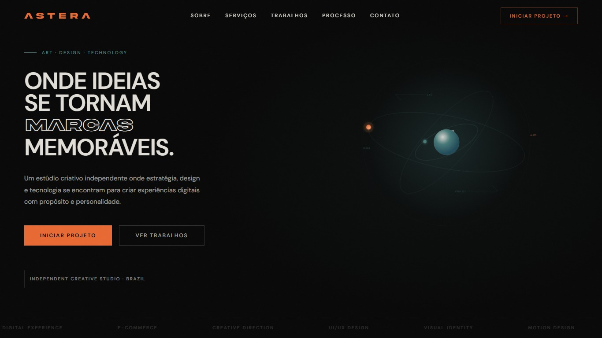

# Astera Studio — Site Institucional


[](https://goastera.com.br/)

<div align="center">

</div>

Site institucional da **Astera Studio**, um estúdio criativo independente que une estratégia, design e tecnologia para criar experiências digitais.

Este repositório apresenta a implementação front-end do projeto, desenvolvido a partir de uma proposta visual criada no Figma e posteriormente estruturado e refatorado em **React + TypeScript**, com foco em arquitetura de componentes, responsividade, acessibilidade, performance e qualidade de código.

## Sobre o projeto

A primeira versão da interface foi desenvolvida com apoio do **Figma Make** e exportada para React. A partir dessa base, o projeto passou por um processo de refatoração para transformar o código gerado em uma aplicação mais organizada, reutilizável e preparada para manutenção e evolução.

O trabalho envolveu revisão da arquitetura, criação de componentes reutilizáveis, centralização de tokens visuais, melhorias de semântica e acessibilidade, otimização de recursos, SEO técnico e validação da interface em diferentes tamanhos de tela.

## Stack

* React 19
* TypeScript
* Vite 8
* Tailwind CSS 4
* HTML5
* CSS3
* Git & GitHub
* Vercel

## Principais implementações

### Arquitetura e componentização

* Organização dos componentes por responsabilidade e domínio.
* Separação entre componentes de interface, layout e seções da página.
* Criação de componentes reutilizáveis para elementos recorrentes da interface.
* Centralização de tokens e constantes para reduzir valores dispersos pelo código.
* Uso de tipos compartilhados com TypeScript.

### Responsividade

A interface foi adaptada para diferentes tamanhos de viewport, incluindo desktop, tablet e mobile.

Entre os principais ajustes estão:

* navegação adaptativa;
* reorganização dos elementos da Hero Section;
* grids responsivos;
* ajustes tipográficos;
* espaçamentos fluidos;
* adaptação de seções e cards para diferentes breakpoints.

### Acessibilidade

O projeto recebeu uma revisão específica de acessibilidade e semântica, incluindo:

* landmarks semânticos;
* `main` único para o conteúdo principal;
* skip link para navegação por teclado;
* hierarquia de títulos;
* elementos decorativos removidos da árvore de acessibilidade;
* navegação por teclado e tratamento de foco;
* suporte a `prefers-reduced-motion`.

### SEO técnico

A estrutura de indexação e compartilhamento do site foi preparada para produção, incluindo:

* metadados de título e descrição;
* canonical para o domínio oficial;
* Open Graph e Twitter Cards;
* `robots.txt`;
* `sitemap.xml`;
* idioma `pt-BR`;
* metadados para dispositivos e tema;
* estrutura semântica de headings e landmarks.

### Performance e otimização

Durante a etapa de refinamento foram realizadas otimizações como:

* conversão e compressão de imagens em WebP;
* otimização do carregamento de recursos;
* self-host das fontes DM Sans e Playfair Display em WOFF2;
* preload de fontes críticas utilizadas na Hero Section;
* remoção da cadeia externa de carregamento do Google Fonts;
* redução de recursos render-blocking;
* validação de tipos e build de produção;
* auditorias de performance, acessibilidade, boas práticas e SEO com Lighthouse.

A investigação do Largest Contentful Paint identificou o carregamento externo das fontes como um dos principais gargalos da renderização inicial no mobile. Após o self-host das fontes e otimização da cadeia crítica, o **LCP mobile foi reduzido de 3,0 s para 1,5 s**.

## Lighthouse

Auditoria realizada em produção no domínio oficial com Lighthouse.

| Categoria | Desktop | Mobile |
| --- | ---: | ---: |
| Performance | **100** | **100** |
| Accessibility | **100** | **100** |
| Best Practices | **100** | **100** |
| SEO | **100** | **100** |

### Métricas de performance

| Métrica | Desktop | Mobile |
| --- | ---: | ---: |
| First Contentful Paint | **0,4 s** | **1,4 s** |
| Largest Contentful Paint | **0,4 s** | **1,5 s** |
| Total Blocking Time | **0 ms** | **0 ms** |
| Cumulative Layout Shift | **0** | **0** |
| Speed Index | **0,6 s** | **1,4 s** |

> Os resultados do Lighthouse são medições de laboratório e podem variar de acordo com ambiente, hardware, rede e condições de execução.

## Estrutura

```text
src/
├── assets/
├── components/
├── constants/
├── theme/
├── types/
├── App.tsx
├── index.css
└── main.tsx
```

A estrutura foi organizada para manter responsabilidades separadas e facilitar a manutenção e evolução da aplicação.

## Executando localmente

Clone o repositório:

```bash
git clone https://github.com/ruthdosanjos/astera-studio-website.git
```

Entre na pasta:

```bash
cd astera-studio-website
```

Instale as dependências:

```bash
npm install
```

Inicie o ambiente de desenvolvimento:

```bash
npm run dev
```

Para validar os tipos:

```bash
npm run typecheck
```

Para gerar o build de produção:

```bash
npm run build
```

## Deploy

O projeto está disponível em produção em:

**[goastera.com.br](https://goastera.com.br/)**

## Contexto

Este projeto faz parte do desenvolvimento da presença digital da **Astera Studio**.

O repositório público foi preparado como uma versão de apresentação técnica do projeto. O desenvolvimento operacional da Astera é mantido separadamente em um repositório privado.

---

Desenvolvido por **Ruth Emilly dos Anjos Paulino**  
Front-end Developer
